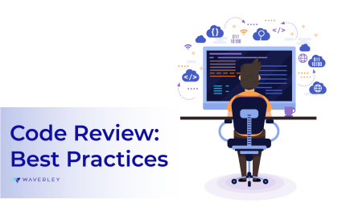
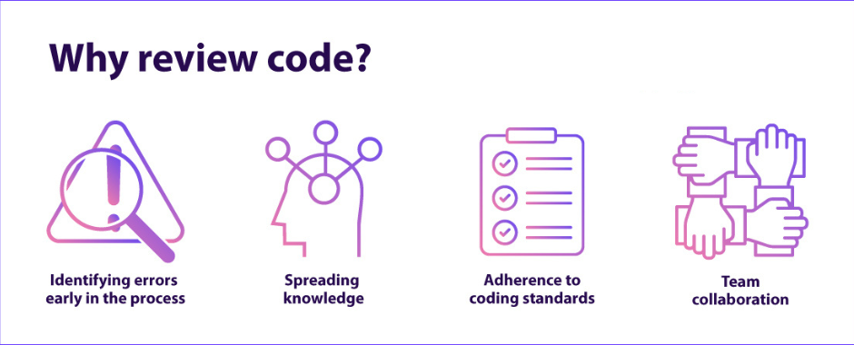

[](https://classroom.github.com/a/_Y4t8UXw)
# dgl104-programming-article-repo

# Code Reviews: Best Practices for Writing and Reviewing Code

## Introduction

### So, what exactly is a code review?
When a developer is finished working on an issue, another developer looks over the code and considers questions like:

- Are there any obvious logic errors in the code?
- Looking at the requirements, are all cases fully implemented?
- Are the new automated tests sufficient for the new code?
- Do existing automated tests need to be rewritten to account for changes in the code?
- Does the new code conform to existing style guidelines?

Code reviews should integrate with a team’s existing process. For example, if a team is using task branching workflows, initiate a code review after all the code has been written and automated tests have been run and passed–but before the code is merged upstream. This ensures the code reviewer’s time is spent checking for things machines miss, and prevents poor coding decisions from polluting the main line of development.

Before a code review even begins, it's essential to ensure that the code being submitted is easy to review. Here are some best practices to keep in mind when writing code:

### 1. Keep Your Changes Small and Focused

Large pull requests (PRs) are difficult to review because they contain too many changes at once. A good rule of thumb is to submit small, focused changes that accomplish one goal.

### 2. Follow Consistent Coding Style

Consistency in code formatting makes it easier for everyone on the team to read and understand the codebase.

**Bad: Inconsistent naming conventions and spacing**
```
class userData:
    def __init__(self, Name, Age):
        self.Name=Name
        self.Age=Age
```
**Good: Follows PEP 8 conventions**
```
class UserData:
    def __init__(self, name, age):
        self.name = name
        self.age = age
```
### 3. Write Clear and Concise Code

Avoid unnecessary complexity and make your code as readable as possible. The goal is for another developer to understand it without extra explanation.

**Bad: Unnecessary nested loops**
```
for user in users:
    for order in orders:
        if order.user_id == user.id:
            print(order.details)
```
**Good: Use dictionary lookup for efficiency**
```
user_orders = {order.user_id: order.details for order in orders}
for user in users:
    print(user_orders.get(user.id, "No orders"))
```

## Best practices for code review
A successful peer review strategy requires balance between strictly documented processes and a non-threatening, collaborative environment. Highly regimented peer reviews can stifle productivity, yet lackadaisical processes are often ineffective. Managers are responsible for finding a middle ground where peer review can be efficient and effective while fostering open communication and knowledge-share between teammates.

- ### Review fewer than 400 lines of code at a time:
A SmartBear study of a Cisco Systems programming team revealed that developers should review no more than 200 to 400 lines of code (LOC) at a time.

- ### Do not review for more than 60 minutes at a time:
Just as you shouldn´t review code too quickly, you also should not review for too long in one sitting. When people engage in any activity requiring concentrated effort over a period of time, performance starts dropping off after about 60 minutes.

- ### Authors should annotate source code before the review
Authors should annotate code before the review occurs because annotations guide the reviewer through the changes, showing which files to look at first and defending the reason behind each code modification. Annotations should be directed at other reviewers to ease the process and provide more depth in context.

- ### Practice lightweight code reviews
Between email, over-the-shoulder, Microsoft Word, tool-assisted and hybrids of all types there are countless ways to collaboratively review code. However, to fully optimize your team´s time and to effectively measure its results, a lightweight, tool-assisted process is recommended.

>> "When done right,
code reviews actually
save time in the long run."

## Choosing the Correct Review Type
You should choose your review method based on your team’s strengths and weaknesses. This will depend on different factors, that are unique to your organization. Perhaps you have a team spread out over many different time zones. Asynchronous would be a good choice.


- **Asynchronous Review:** Suppose you have a team that is spread out over many different time zones. Asynchronous review would be an ideal choice for your team because it allows for flexibility.
- **Instant or Synchronous Reviews:** These reviews are perfect if you have a development team that is fast moving, and responsible for high priority releases.
- **Team Review:** In case a developer has made sweeping changes to the code base, then a team review is beneficial, as it helps to timebox the feedback cycle.

## Conclusion

Code reviews are an essential part of modern software development. Writing reviewable code and providing constructive feedback during reviews can greatly improve code quality, reduce bugs, and create a collaborative team culture.
By mastering code review practices, you’ll not only improve as a developer but also contribute to a healthier, more efficient development workflow.

## References
- Atlassian: https://www.atlassian.com/agile/software-development/code-reviews
- AK DevCraft: https://dev.to/akdevcraft/how-to-review-code-2gam
- https://levioconsulting.com/insights/4-different-types-of-code-reviews/
- https://smartbear.com/learn/code-review/best-practices-for-peer-code-review/